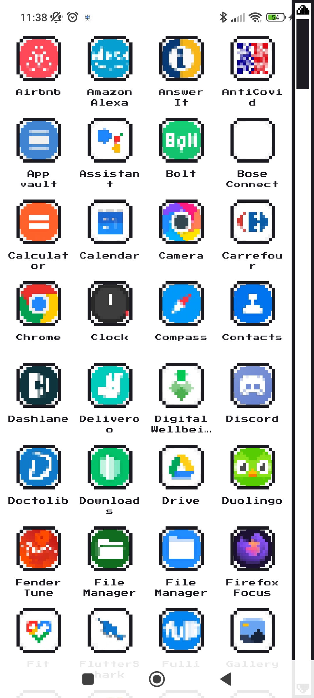
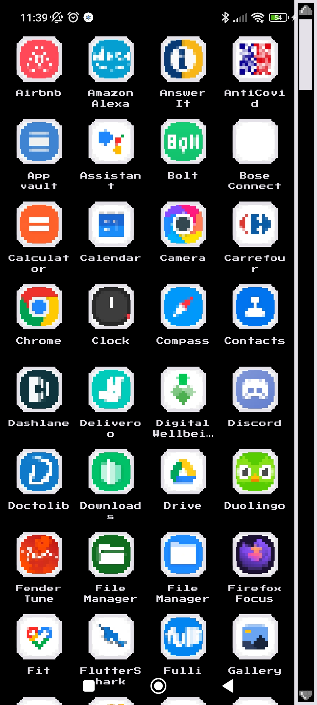

# Retro Launcher

A custom Android launcher created with Flutter, with a retro video game-inspired UI.

The project was mainly made to try creating an Android launcher with Flutter and to test [nes_ui](https://github.com/erickzanardo/nes_ui) package. I do not plan on making it a fully fledged Android launcher with nor providing support.

## Screenshots

* Supports light & dark mode

| Light  | Dark |
| ------------- | ------------- |
|  |   |

